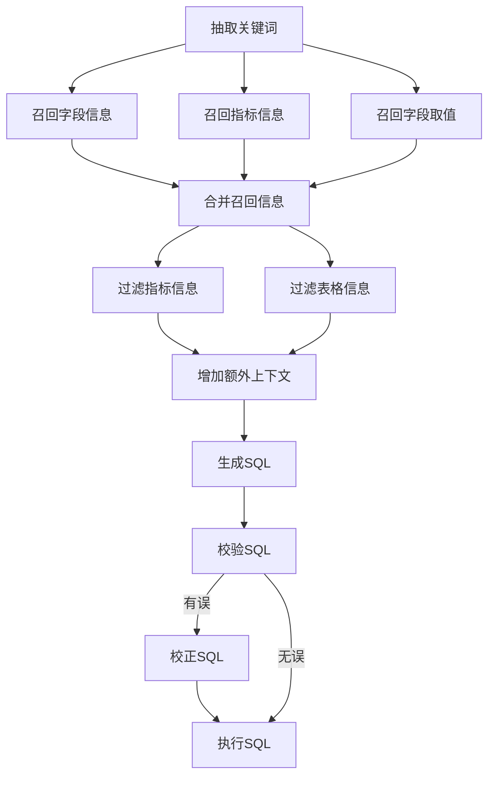
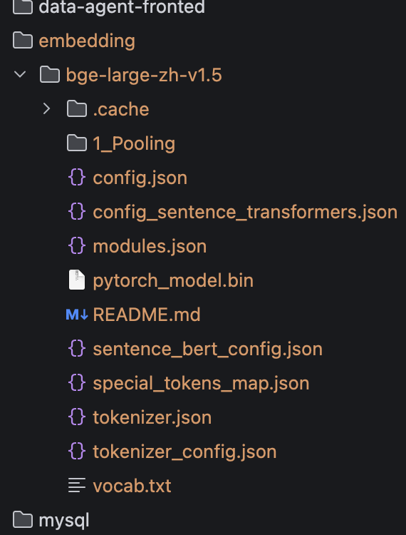

# data-agent

# 1. 创建虚拟环境（当前目录生成 venv 文件夹）
python3 -m venv venv

# 2. 激活环境
source venv/bin/activate

deactivate

# 3. 正常安装包
pip3 install "fastapi[standard]" langchain_huggingface
sqlalchemy omegaconf elasticsearch qdrant_client loguru langgraph
langchain  langchain-openai jieba aiohttp asyncmy greenlet cryptography

fastapi dev main.py

使用本地模型 ，从线上拉取过慢，国内镜像拉取 会报错  Header etag is missing

source venv/bin/activate
# 国内镜像加速
export HF_ENDPOINT=https://hf-mirror.com
下载模型：
hf download BAAI/bge-large-zh-v1.5 --local-dir ./models/bge-large-zh-v1.5

下载后，如果缺少一堆json文件，则https://hf-mirror.com/BAAI/bge-large-zh-v1.5，逐个下载

在 SwaggerUI 中可以查看在线文档：http://127.0.0.1:8000/docs

问：
统计各地区销量排行前三的商品

流程图：

    

在目录下创建embedding文件夹，放bge模型，结构如下
